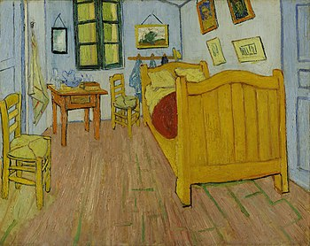
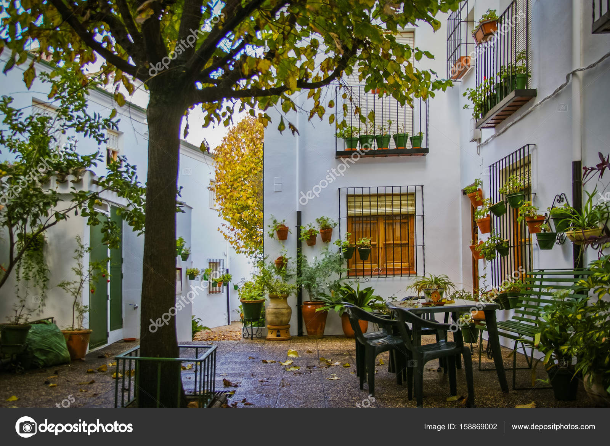
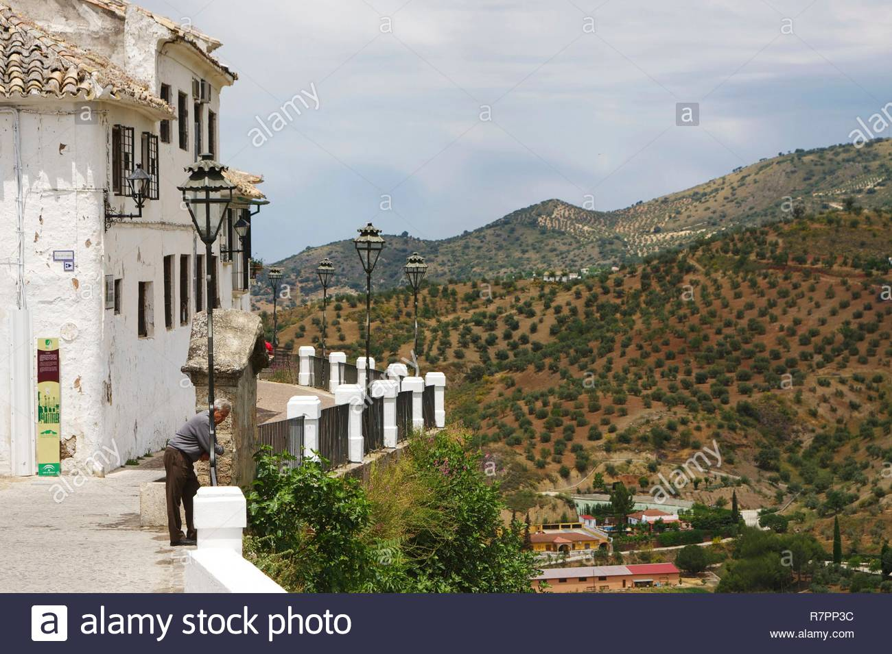

# Tema 3. Hier finden Sie Ruhe und Erholung

### Vocabulario

der Spiegel - El espejo <br>
das Bild - El cuadro, la fotografía <br>
die Decke - El techo <br>
die Ecke - La esquina <br>
die Seife - El jabón <br>
das Handtuch - La toalla <br>
die Ruhe - Tranquilidad <br>
die Entspannung - Relajación <br>
die Enrholung - Descanso <br>
der Kräutertee - Infusión de hierbas <br>
der Bergkräutertee - Infusión de hierbas de la montaña <br>
die Luft - El aire <br>
die Ordnung - El orden <br>
hinunter - hacia abajo <br>
herzlich - afectuoso <br>
die Unterricht  - la clase <br>
anmelden - anunciar, avisar, matricular, inscribir <br>
der Anfänger - el principiante <br>
entlang - a lo largo de <br>
die Anstrengung - el esfuerzo <br>
der Blick - la mirada, el vistazo <br>
beraten - aconsejar <br>
die Karte - Mapa, tarjeta, carta, billete, boleto <br>
die Ausrüstung - El equipo, el equipamiento <br>
vermieten - alquilar <br>
die Miete - El alquiler <br>
der Mieter - El arrendatario <br>
der Vermieter - El arrendador <br>
die Kaution - La fianza <br>
der Lieberhaber - El amante <br>
der Naturlieberhaber - El amante de la naturaleza <br>
übernachten - pernoctar <br>
das Zelt - la tienda de campaña  <br>
der Campingplatz - El camping

### Gramática

<span style="color:#fcba03">an</span> <span style="color:#4287f5">der</span> Ecke - En la esquina <br>
<span style="color:#fcba03">verbos como hängen, o cosas que están en la pared integradas</span> <br>
<span style="color:#4287f5">Dativo</span>

### Recordatorio
```
dinámicos (Akk.): legen - stellen - hängen
estáticos (Dat.): liegen - stehen - hängen
```
das Fenster steht zwischen <span style="color:#4287f5">dem</span> Spiegel und <span style="color:#4287f5">dem</span> Bild.

das Hangtuch hängt <span style="color:#fcba03">an</span> <span style="color:#4287f5">der</span> Wand

#### Para revisar junto a `Vocabulario > Preposiciones`

En la playa - Am Strand <br>
Yo voy a la playa - Ich gehe an den Strand <br>
Worauf - A qué ... ? <br>
Worauf wartest du noch ? - A qué esperas?

#### Ejercicio: describir un paisaje
 <br>


In dem Bild gibt es viele Dinge. <br> <br>

 <br>

Links <span style="color:#32a852">dem</span> Bild <span style="color:#4c7bfc">liegen</span> die Häuser. Sie sind weiß und alt. <br>
<span style="color:#4c7bfc">Vor</span> <span style="color:#32a852">den</span> Häuser gibt es eine Steinstraße und eine Landschaft. <br>
Die Straßelanternen <span style="color:#4c7bfc">steht</span> entlang <span style="color:#32a852">der Straße</span> <br>
Zwischen <span style="color:#32a852">den</span> Straßelanternen <span style="color:#4c7bfc">steht</span> der Zaun. <br>

Rechts <span style="color:#32a852">dem</span> Bild <span style="color:#4c7bfc">steht</span> ein Berg. <br>
Über <span style="color:#32a852">dem</span> Berg stehen die Olivenbaumen.

Im <span style="color:#32a852">dem</span> Bild <span style="color:#4c7bfc">steht</span> eine Person. <br>
die Persone ist alt. <br>
Er sieht die Landschaft an. <br>
In der Nähe <span style="color:#4c7bfc">von</span> <span style="color:#32a852">ihm</span> gibt es ein Steinbrunnen. <br>
