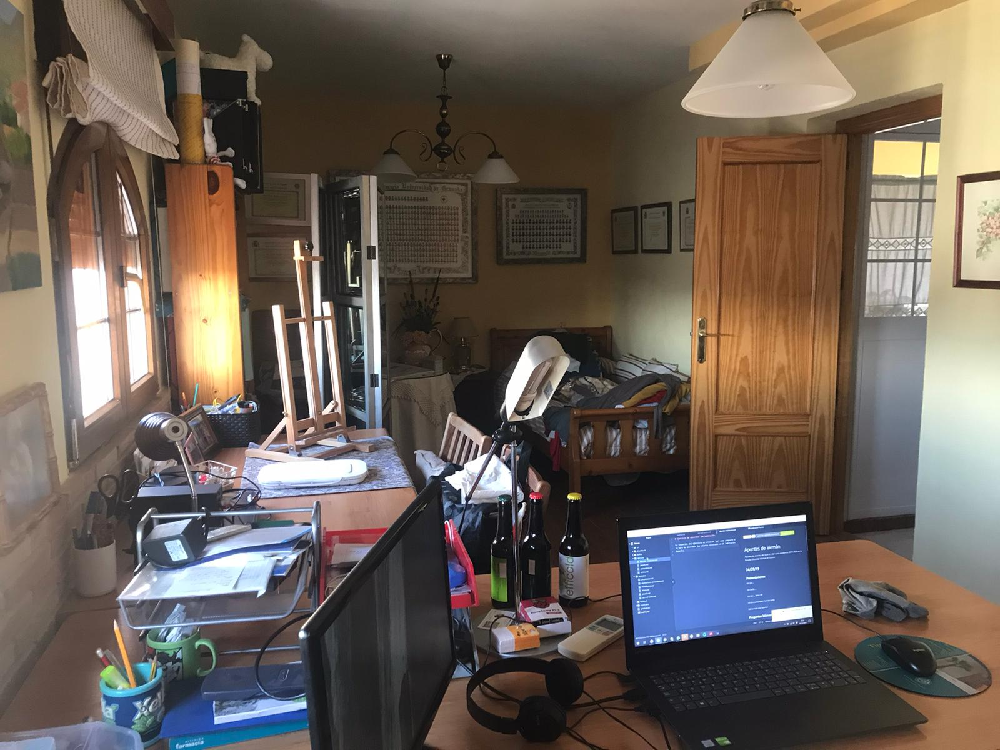

# Ejercicio de describir una habitación.

La intención del ejercicio es utilizar `wo` como pregunta a la hora de describir los objetos colocados en mi habitación favorita.

Mein Lieblingszimmer ist der Dachboden.  
Es gibt drei Fenster vor der Tür.  
Neben der Tür, hängt ein Bild.  
Der Schreibtisch steht zwischen den Fenster und der Tür.  
Auch, steht ein Schrank zwischen zwei Fenster.  
Zwei Lampen hängen auf dem Dach.  
Viele Bücher liegen auf dem Boden.  
Ein Bett steht in einer Ecke.  
Auf dem Tisch, steht meine Staffelei.  
Ich male Bilder vor dem Fenster.  
