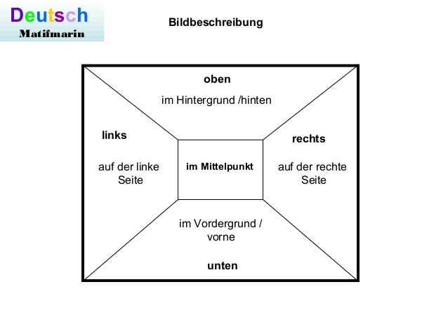

# Cómo describir una fotografía / imagen

W-Wörter: wer, was, wann, wo, wie, warum, woher, wie viel, wohin

Präpositionen und adverben:
* in, an, auf, vor, hinter, neben, mit +  Nomen
* links, rechts, oben, unten, im Vordergrund, im Hintergrund +  Verb 

_Assoziationen:_

Ich blaube, ich denke, ich meine, ich assoziiere das Bild mit + ...

Ich denke, der Mann ist schon lange gewandert. Er sieht mude aus.

Ich glaube,  der Mann möchte etwas trinken. Er wirkt durstig.

Ich assoziere das Bild mit Ferien, Wochenende, Freizeit. Ich selbst gehe auch gern wandern.

#### Tip

Utilizar:
* [adverbios de posibilidad o probabilidad](../vocabulario/adv-probabilidad.md)
* Es macht auf mich dein Eindruck, das - Me da la impresión de que
