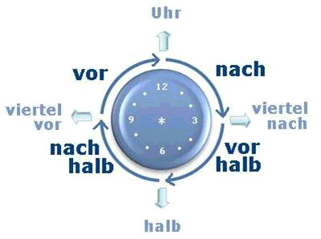

# La hora

## Esquema general

| Hora | Alemán |
| ----- | ----- |
| 00:00 | Cotidiano: Mitternacht,   zwölf Uhr,   vierundzwanzig Uhr,   Oficial: null Uhr |
| 01:00 | ein Uhr (madrugada) |
| 07:00 | sieben Uhr (7 A.M.) |
| 07:15 | Viertel nach sieben, viertel acht.   Formal: sieben Uhr fünfzehn |
| 07:25 | Cotidiano: fünf vor halb **acht**   Oficial: sieben Uhr fünfundzwanzig |
| 07:30 | Cotidiano: halb **acht**   Oficial: sieben Uhr dreißig |
| 07:35 | Cotidiano: fünf nach halb **acht**   Oficial: sieben Uhr fünfunddreißig |
| 07:45 | Cotidiano: Viertel vor acht   drei Viertel acht   Oficial: sieben Uhr fünfundvierzig |
| 12:00 | Cotidiano: Mittag   Oficial: zwölf Uhr |
| 13:00 | Cotidiano: ein Uhr   Oficial: dreizehn Uhr |
| 19:00 | Cotidiano: sieben (Uhr)   Oficial: neunzehn Uhr |
| 19:25 | Cotidiano: fünf vor halb acht   sieben Uhr fünfundzwanzig   Oficial: neunzehn Uhr fünfundzwanzig |

## Preguntas relacionadas con la hora
* Wann beginnt der Unterricht? 
¿Cuándo empieza la clase?

* Der Unterricht beginnt um 9 Uhr 
La clase empieza a las 9

* Um wie viel Uhr beginnt der Unterricht? Um 9 Uhr. 
¿A qué hora empieza la clase? A las 9.

* Wie lange dauert der Unterricht? 
¿Cuánto tiempo dura la clase?

* Der Unterricht dauert 45 Minuten 
La clase dura 45 minutos

* Von wann bis wann haben wir Unterricht? 
¿Desde cuándo hasta cuándo tenemos clase?

* Am Vormittag haben wir von 9 bis 12 Uhr Unterricht 
Por la mañana desde las 9 hasta las 12

## Momentos del día

| Alemán | Castellano |
| ----- | ----- |
| das Morgengrauen | la madrugada |
| der Morgen | la mañana |
| der Vormittag | la mañana (antes de comer) |
| der Mittag | el mediodía |
| der Nachmittag | la tarde (después de comer) |
| der Abend | la tarde|
| die Nacht | la noche|

| am Montag |	el lunes |
| ----- | ----- |
| Montag |	lunes |
| Montagmorgen	| mañana del lunes |
| Montagvormittag |	lunes por la mañana |
| Montagmittag |	lunes al mediodía |
| Montagnachmittag |	lunes por la tarde |
| Montagabend |	lunes por la noche |
