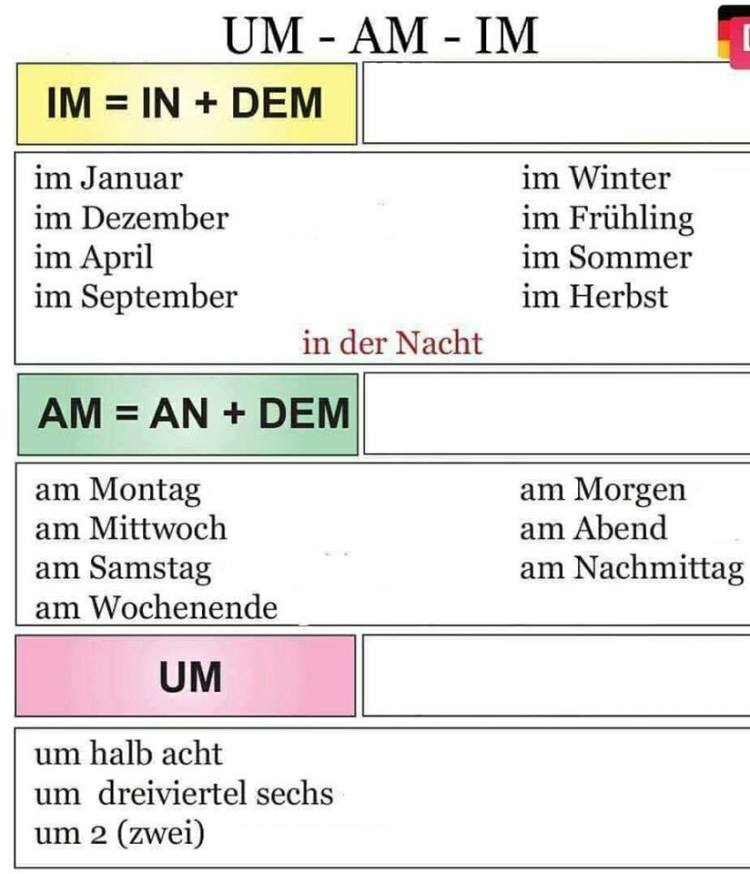

# Preposiciones Am Im Um

Cuando utilizar cada una de ellas:

#### Estaciones y años: `im`
Im Winter, im Frühling, im Sommer, im Herbst...  
Im Jahre 2005...

#### Fechas, momentos del día: `am`
Am 8.August,  
Am Morgen, am Tage, am Vormittag, am Nachmittag  
Excepción: **in** der Nacht

#### Horas `um`
Um 7 Uhr,  
Um halb neun,  
Um Mitternacht,  

#### Tabla

| Preposicion + caso | ejemplo |
| ----- | ----- |
| um + Akk. | Der Zug fährt um 17:45 Uhr von Berlin ab |
| am + Dat. | Am Montag male ich den Bilder |
| im + Dat. | Im Winter besuche ich dir |

#### De donde vienen

Im = in + dem
Am = an + dem

