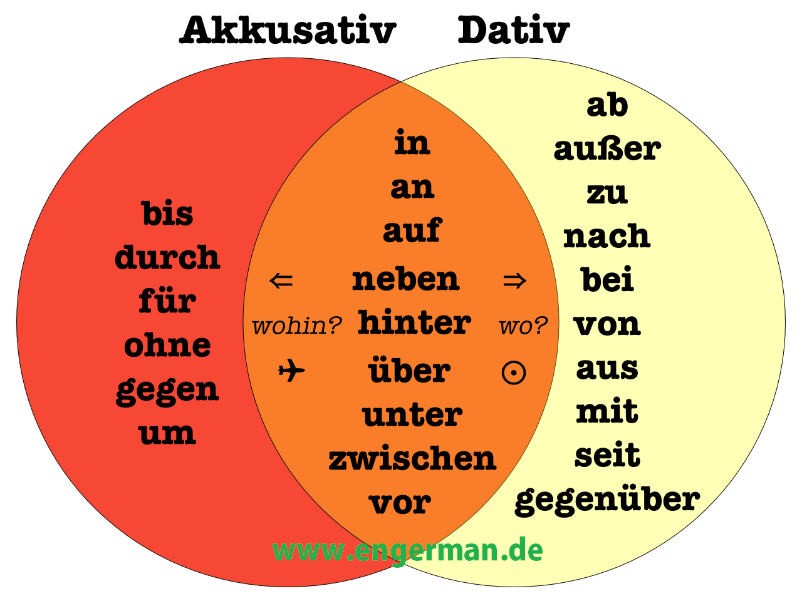

# Preposiciones




#### Dativo

```
                        zum Bahnhof (der Bahnhof)
Ich gehe von Schule bis zur Post (die Post)
                        nach Hause
```

#### Verbos que rigen dativo o acusativo

| Acusativo | Dativo |
| ----- | ----- |
| legen | liegen |
| stellen | stehen |

```
Mein Auto steht hinter dem Lastwagen (dat.)
Ich fahre mein auto hinter den Lastwagen (akk.)
```
```
Das Bild hängt sehr schön über dem Sofa (dat.)
Ich möchte das Bild über das Sofa hängen (akk.)
```
