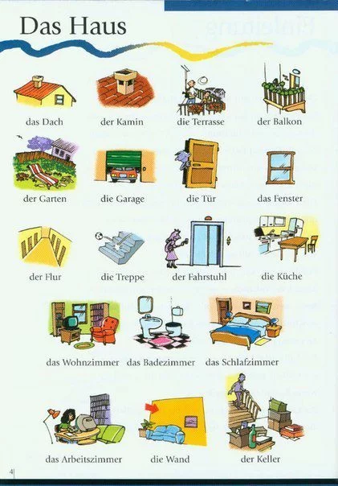

# Partes de la casa

| Castellano | Alemán |
| ----- | ----- |
| Ascensor | der Aufzug |
| Balcón | der Balkon |
| Chimenea | der Kamin |
| Chimenea | der Schornstein |
| Cocina | die Küche |
| Cochera | die Garage |
| Escalera | die Treppe |
| Entrada | der Eingang |
| Jardín | der Garten |
| Pasillo | der Flur |
| Patio | der Hof |
| Pared | die Wand |
| Suelo | der Boden |
| Techo | die Decke |
| Tejado | das Dach |
| Terraza | die Terrasse |
| Ventana | das Fenster |
